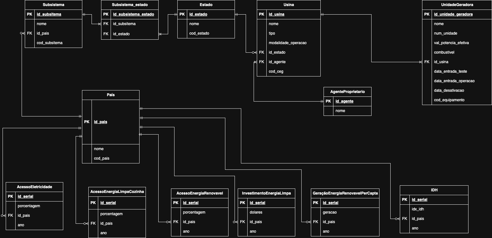

# MC536: Database Project - Renewable Energy and Development Indicators

## Project Overview
This project was developed by  
[Tiago Perrupato](https://github.com/tiagoperrupato) RA 194058

This repository contains the coursework for **MC536: Databases - Theory and Practice**. The project involves designing, implementing, and querying a PostgreSQL database to analyze relationships between electricity, renewable energy generation, clean energy investments, and development indicators using open-source data. We use data from Brazil and and its states and other countries.

## Database Schema Overview

The core of this project is the relational database designed to integrate the different datasets. Below are visualizations of the conceptual and relational models:

**Figure 1: Conceptual Model (ER Diagram)**  


**Figure 2: Relational (Logical) Model**  


*(The detailed Physical Model SQL script can be found [here](./models/physical-model.sql)).*

---

## Table of Contents

- [Project Goals](#project-goals)
- [Datasets](#datasets)
  - [Original Data](#original-data)
  - [Preprocessed Data](#preprocessed-data)
- [Database Schema](#database-schema)
- [Technology Stack](#technology-stack)
- [Project Structure](#project-structure)
- [Setup and Usage](#setup-and-usage)
  - [Prerequisites](#prerequisites)
  - [Database Setup](#database-setup)
  - [Running the Code](#running-the-code)
- [Data Preprocessing](#data-preprocessing)
- [Analysis & Queries](#analysis--queries)
- [Results](#results)
- [License](#license)
- [Acknowledgements](#acknowledgements)

## Project Goals

*   Design a relational database schema (Conceptual, Logical, Physical models) to integrate data from diverse sources.
*   Implement the database schema in PostgreSQL.
*   Develop Python scripts using `psycopg2` within a Jupyter Notebook to:
    *   Create database tables.
    *   Load the data from CSV files into the PostgreSQL database.
*   Execute meaningful, non-trivial SQL queries to explore potential correlations and insights regarding:
    *   Access to electricity and renewable energy.
    *   Clean energy investments and development indicators.
    *   Renewable energy generation per capita.
    *   Trends over time for specific countries and indicators.

## Datasets

### Original Data

The raw data was sourced from various open datasets. The original files are located in the `/data` directory:

*   `CAPACIDADE_GERACAO.csv`: Contains data on electricity generation capacity in Brazil.
*   `share-of-the-population-with-access-to-electricity.csv`: Data on access to electricity in many countries.
*   `access-to-clean-fuels-and-technologies-for-cooking.csv`: Data on access to clean fuels and technologies in many countries.
*   `share-of-final-energy-consumption-from-renewable-sources.csv`: Data on renewable energy consumption in many countries.
*   `international-finance-clean-energy.csv`: Data on international financial flows for clean energy in many countries.
*   `HDR23-24_Composite_indices_complete_time_series.csv`: Data on Human Development Index (HDI) in many countries.

## Database Schema

The database schema was designed through conceptual and logical modeling stages, resulting in the physical implementation in PostgreSQL.

*   **Conceptual Model:** *(Add link to your conceptual model here)*
*   **Relational (Logical) Model:** *(Add link to your relational model here)*
*   **Physical Model (SQL DDL):** [`/models/physical-model.sql`](./models/physical-model.sql)

The main tables include:
*   `Pais`: Stores country names and ISO codes.
*   `Subsistema`: Stores regional subsystems and their relationships to countries.
*   `Estado`: Stores state-level data and their relationships to regions.
*   `Agente_Proprietario`: Stores information about energy agents.
*   `Usina`: Stores power plant data.
*   `Unidade_Geradora`: Stores generating unit data.
*   `Acesso_Eletricidade`: Stores data on access to electricity.
*   `Acesso_Energia_Renovavel`: Stores data on renewable energy access.
*   `Acesso_Combustivel_Limpo`: Stores data on access to clean fuels.
*   `Investimento_Energia_Limpa`: Stores data on clean energy investments.
*   `Energia_Renovavel_Per_Capita`: Stores data on renewable energy generation per capita.
*   `IDH`: Stores Human Development Index data.

Foreign key relationships link the fact tables to the dimension tables.

## Technology Stack

*   **Database:** PostgreSQL (tested with version 14+)
*   **Language:** Python 3.x
*   **Libraries:**
    *   `psycopg2-binary`: PostgreSQL adapter for Python.
    *   `pandas`: Data manipulation and analysis (used in preprocessing and query result display).
    *   `jupyterlab` / `notebook`: For running the `.ipynb` files.
*   **Tools:** pgAdmin 4 (for database management)

## Project Structure
```bash
MC536-Project/
│
├── data/ # Original raw datasets
│ ├── CAPACIDADE_GERACAO.csv
│ ├── share-of-the-population-with-access-to-electricity.csv
│ ├── access-to-clean-fuels-and-technologies-for-cooking.csv
│ ├── share-of-final-energy-consumption-from-renewable-sources.csv
│ ├── international-finance-clean-energy.csv
│ └── HDR23-24_Composite_indices_complete_time_series.csv
│
├── models/ # Database model files
│ ├── physical-model.sql
│ └── conceptual-model.png
│ └── relational-model.png
│
├── results/ # Output CSV files from analytical queries
│ ├── query_1_result.csv
│ ├── query_2_result.csv
│ ├── query_3_result.csv
│ ├── query_4_result.csv
│ └── query_5_result.csv
│
├── Database_Execution.ipynb # Jupyter notebook for DB creation, data loading, and querying
├── DB_creation_script.sql # SQL file to generate the database in postegres
└── README.md # This file
```

## Setup and Usage

### Prerequisites

1.  **Python 3.x:** Ensure Python 3 is installed.
2.  **PostgreSQL:** Install and run a PostgreSQL server (e.g., version 14 or higher).
3.  **Docker:** Install Docker to run PostgreSQL and pgAdmin containers.
4.  **pip:** Python package installer.
5.  **Required Python Libraries:** Install necessary libraries:
    ```bash
    pip install psycopg2-binary pandas jupyterlab "ipykernel>=6"
    ```
    *(Note: `ipykernel` is needed for Jupyter notebooks.)*
6.  **Clone Repository:** Clone this repository to your local machine.
    ```bash
    git clone <repository-url>
    cd MC536-Projeto1
    ```
7.  **CSV Files:** Ensure the CSV files are present in the  directory `/data`.

### Database Setup

1.  **Create Database:** Use pgAdmin or `psql` to create the database:
    ```sql
    CREATE DATABASE my_database;
    ```

2.  **Configure Connection:** Open the  notebook. Locate the database connection parameters near the beginning of the script and **update the `DB_CONFIG` dictionary** with your actual PostgreSQL credentials. Adjust other parameters (user, host, port, dbname) if necessary.

    ```python
    # Database configuration parameters
    DB_CONFIG = {
        'dbname': 'my_database',  # Replace with your database name
        'user': 'postgres',       # Replace with your username
        'password': 'mypassword', # Replace with your password
        'host': '127.0.0.1',
        'port': '5433'
    }
    ```

### Running the Code

1.  **Start Jupyter:** Navigate to the repository directory in your terminal and launch Jupyter Lab or Notebook:
    ```bash
    jupyter lab
    ```
    or
    ```bash
    jupyter notebook
    ```

2.  **Open Notebook:** Open the  notebook in Jupyter.

3.  **Execute Cells:** Run the cells in the notebook sequentially.
    *   The notebook will first connect to the database.
    *   It will then execute the SQL DDL script to create the tables and constraints.
    *   Next, it will read data from the CSV files in the  directory and load it into the corresponding database tables. Progress messages will be printed.
    *   Finally, it will execute predefined analytical SQL queries and display their results within the notebook (using pandas DataFrames).

## Data Preprocessing

The preprocessing steps are embedded within the  notebook. These steps include cleaning, normalizing, and transforming the raw data to fit the database schema.

## Analysis & Queries

The core analysis is performed through SQL queries embedded within the  notebook. Several non-trivial queries were designed to investigate relationships between the datasets, including:

## Analysis & Queries

The core analysis is performed through SQL queries embedded within the notebook. Several non-trivial queries were designed to investigate relationships between the datasets, including:

1. **Comparison of Average Electricity Access: Brazil vs. Global Average**  

2. **Top 10 Countries with Renewable Energy**  

3. **Correlation between HDI and Renewable Energy Generation per Capita**  

4. **Agents with Multiple Power Plants in Brazil**  

5. **Power Plants by Fuel Type in Brazil**  

6. **Total Power Generation Capacity by State in Brazil**  

7. **Percentage of Renewable vs. Non-Renewable Power Plants by State**  

The SQL code for each query is documented within the notebook.

## Results

The output/results generated by executing the analytical SQL queries in the notebook are saved as CSV files in the `/results` directory for easy inspection:

*   `query_1_result.csv`
*   `query_2_result.csv`
*   `query_3_result.csv`
*   `query_4_result.csv`
*   `query_5_result.csv`
*   `query_6_result.csv`
*   `query_7_result.csv`

## Acknowledgements

*   Data provided by various open datasets. One can find them in [ONS](https://dados.ons.org.br/dataset/capacidade-geracao), [HDR](https://hdr.undp.org/data-center/documentation-and-downloads) and [OWD](https://ourworldindata.org/sdgs/affordable-clean-energy).
*   This project was developed as part of the MC536 course at Unicamp.